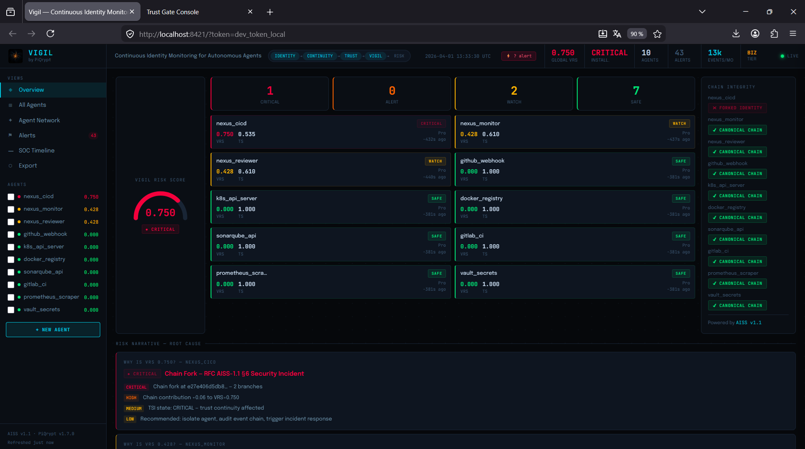
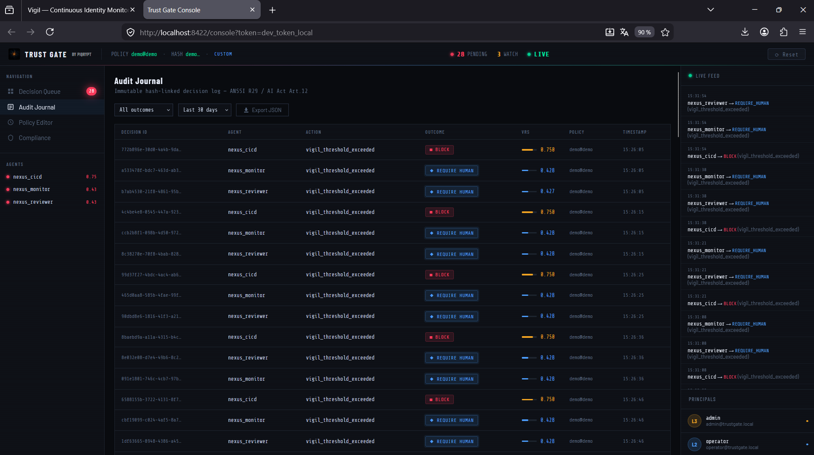

<div align="center">

# PiQrypt

### Every action your AI agent takes — signed, chained, provable.

[](https://pypi.org/project/piqrypt/)
[](https://pypi.org/project/piqrypt/)
[](https://github.com/piqrypt/piqrypt/actions)
[](https://pypi.org/project/piqrypt/)
[](LICENSE)
[](https://csrc.nist.gov/pubs/fips/204/final)
[](https://www.inpi.fr)

**472 tests · 9 framework bridges · 4-layer stack · EU AI Act ready**

[Website](https://piqrypt.com) · [Quick Start](QUICK-START.md) · [PyPI](https://pypi.org/project/piqrypt/) · [Protocol](docs/RFC_AISS_v2.0.md)

---

⭐ **If PiQrypt is useful to you, a star helps others find it** — [star on GitHub](https://github.com/piqrypt/piqrypt)
[](https://github.com/piqrypt/piqrypt)

</div>


---

```
WITHOUT PiQrypt                          WITH PiQrypt
──────────────────────────────           ──────────────────────────────────────────
agent.execute(action)                    event = aiss.stamp_event(priv, agent_id, {
                                             "action": "portfolio_rebalance",
What happened?                               "confidence": 0.94
  UNKNOWN                                })
                                         aiss.store_event(event)
Who authorized it?
  UNKNOWN                                # Who acted?      ✅ agent_id: PIQR1a3f8...
                                         # What happened?  ✅ signed · hash-chained
Can we prove it?                         # Authorized?     ✅ TrustGate: ALLOW
  NO                                     # Provable?       ✅ .pqz · offline · legal
```

---

## What is PiQrypt?

PiQrypt is the **cryptographic identity, memory and governance layer** for autonomous AI agents.

It answers three questions regulators and auditors are asking today: *who acted, what happened, should it have?* — with cryptographic proof, offline-verifiable, cross-framework, portable in a self-contained `.pqz` archive readable without PiQrypt installed.

> Just as OAuth solved delegated authorization without sharing credentials —
> **PCP (Proof of Continuity Protocol)** does the same for AI agent accountability.
> The infrastructure primitive that was missing.

---

## Why now

Autonomous agents execute financial transactions, generate legally relevant content, and coordinate without human review — in production, today. Three regulatory frameworks are converging simultaneously:

| Framework | What it requires |
|---|---|
| **EU AI Act** — Art. 12/14 | Inviolable logs · human oversight mandatory |
| **ANSSI 2024** — R25/R29 | Dangerous pattern filtering · audit trail |
| **NIST AI RMF** — MANAGE 2.2 | Agentic AI supervision · verifiable decisions |

Traditional logs are forgeable. Traditional monitoring is session-scoped. Neither was designed for adversarial or legal scrutiny. PiQrypt was.

---

## Quick Start

```bash
pip install piqrypt
```

Launch the full stack:

```bash
piqrypt start                              # interactive tier selection
piqrypt start --tier free                  # Vigil dashboard · port 8421
piqrypt start --tier business --manual     # + TrustGate human approval queue
```

Python API — two lines to get started:

```python
import piqrypt as aiss

private_key, public_key = aiss.generate_keypair()
agent_id = aiss.derive_agent_id(public_key)

event = aiss.stamp_event(
    private_key, agent_id,
    {"action": "recommendation", "asset": "AAPL", "confidence": 0.94}
)
aiss.store_event(event)
aiss.verify_chain([event])  # ✅ Chain verified — 1 event, 0 anomalies
```

LangChain — one parameter, agent unchanged:

```python
from piqrypt.bridges.langchain import PiQryptCallbackHandler
from langchain.agents import AgentExecutor

agent = AgentExecutor(
    agent=your_agent, tools=your_tools,
    callbacks=[PiQryptCallbackHandler(identity=agent_id)]
)
# CrewAI:  from piqrypt.bridges.crewai import AuditedAgent as Agent
# AutoGen: from piqrypt.bridges.autogen import AuditedAssistant
# MCP:     from piqrypt.bridges.mcp import AuditedMCPClient
```

CLI:

```bash
piqrypt identity create my_agent
piqrypt stamp my_agent --payload '{"action":"trade","symbol":"AAPL"}'
piqrypt verify my_agent
# ✅ Chain integrity verified — 12 events · trust_score: 0.94 · TrustGate: ALLOW
```

---

## Architecture — 4 layers

```
Your agents (LangChain · CrewAI · AutoGen · MCP · Ollama · ROS2 · RPi · …)
│
│  2 lines of code
│
┌───────────────────────────▼─────────────────────────────────────────┐
│  TrustGate — Policy engine                             port 8422     │
│  ALLOW · REQUIRE_HUMAN · BLOCK · QUARANTINE                          │
├─────────────────────────────────────────────────────────────────────┤
│  Vigil — Real-time behavioral monitoring               port 8421     │
│  VRS risk score · A2C anomaly detection · TSI                        │
├─────────────────────────────────────────────────────────────────────┤
│  PiQrypt Core — Continuity engine                                    │
│  .pqz portable archives · RFC 3161 TSA · Dilithium3                 │
├─────────────────────────────────────────────────────────────────────┤
│  AISS — Agent Identity Signing Standard                MIT ©2026     │
│  Ed25519 identity · SHA-256 hash chains · PCP                        │
└─────────────────────────────────────────────────────────────────────┘
```

| Layer | License | What it does |
|---|---|---|
| **AISS** | MIT | Identity, signing, chain verification, A2A handshake |
| **PiQrypt Core** | ELv2 | VRS scoring, `.pqz` certified archives, RFC 3161 |
| **Vigil** | ELv2 | Real-time behavioral dashboard — port 8421 |
| **TrustGate** | ELv2 | Deterministic policy engine — port 8422 |

---

## Framework Bridges

**9 bridges. Zero code change on your agent.**

| Bridge | Install | Integration |
|---|---|---|
| LangChain | `pip install piqrypt[langchain]` | `PiQryptCallbackHandler` |
| CrewAI | `pip install piqrypt[crewai]` | `AuditedAgent`, `AuditedCrew` |
| AutoGen | `pip install piqrypt[autogen]` | `AuditedAssistant` |
| MCP | `pip install piqrypt[mcp]` | Tool middleware |
| Ollama | `pip install piqrypt[ollama]` | Request wrapper |
| Session | `pip install piqrypt[session]` | N-agent co-signed sessions |
| OpenClaw | `pip install piqrypt[openclaw]` | Action stamper |
| ROS2 | `pip install piqrypt[ros]` | `AuditedNode` |
| Raspberry Pi | `pip install piqrypt[rpi]` | `AuditedPiAgent` |

```bash
pip install piqrypt[all-bridges]   # install all at once
```

**Privacy by design:** raw prompts, model responses, and tool outputs are never stored — only their SHA-256 fingerprints. Structural, not configurable.

**Offline by default:** no third-party server receives any data. The `.pqz` audit archive is verifiable without access to the original infrastructure.

---

## Cross-framework trust — AgentSession

When agents from different frameworks collaborate, `AgentSession` records the full interaction as co-signed, independently verifiable chain entries — without a shared server.

```python
from bridges.session import AgentSession
import piqrypt as aiss

planner_key,  planner_pub  = aiss.generate_keypair()
executor_key, executor_pub = aiss.generate_keypair()
reviewer_key, reviewer_pub = aiss.generate_keypair()

session = AgentSession(agents=[
    {"name": "planner",  "agent_id": aiss.derive_agent_id(planner_pub),
     "private_key": planner_key,  "public_key": planner_pub},
    {"name": "executor", "agent_id": aiss.derive_agent_id(executor_pub),
     "private_key": executor_key, "public_key": executor_pub},
    {"name": "reviewer", "agent_id": aiss.derive_agent_id(reviewer_pub),
     "private_key": reviewer_key, "public_key": reviewer_pub},
])
session.start()
# → 3 co-signed handshakes recorded (N*(N-1)/2 pairs), one in each agent's chain

session.stamp("planner",  "task_delegation", {"task": "analyze_portfolio"}, peer="executor")
session.stamp("executor", "task_completed",  {"result_hash": "…"},          peer="reviewer")
session.stamp("reviewer", "review_signed",   {"approved": True},            peer="planner")
```

**[→ A2A Session Guide](docs/A2A_SESSION_GUIDE.md)**

---

## Project Status

| Component | Status | Notes |
|---|---|---|
| AISS core | ✅ Stable | `pip install piqrypt` |
| Framework bridges (9) | ✅ Stable | `pip install piqrypt[langchain]` etc. |
| Vigil dashboard | ✅ Stable | Standalone · port 8421 |
| TrustGate | ✅ Stable | Standalone · port 8422 |
| Trust-server | ✅ Production | `trust-server-ucjb.onrender.com` |

**v1.7.1** · Python 3.9–3.12 · Linux · macOS · Windows

---

## Standards implemented

| Standard | Purpose | Tier |
|----------|---------|------|
| Ed25519 (RFC 8032) | Agent signatures — STANDARD | All |
| Dilithium3 (NIST FIPS 204) | Post-quantum signatures — QUANTUM | Pro+ |
| SHA-256 (NIST FIPS 180-4) | Hash chains | All |
| AES-256-GCM (NIST FIPS 197) | Key encryption at rest | Pro+ |
| scrypt N=2¹⁷ (RFC 7914) | Key derivation | Pro+ |
| RFC 3161 | Trusted timestamps (TSA) | Pro+ |
| RFC 8785 | JSON canonicalization | All |

---

## Threat model

PiQrypt protects against post-event log modification, identity repudiation, timeline alteration (TSA-anchored), behavioural anomalies, and unsupervised critical actions (TrustGate).

PiQrypt does **not** protect against compromised private keys, malicious logic before stamping, or fully compromised hosts. See [SECURITY.md](SECURITY.md) for the complete threat model.

---

## Pricing

| Tier | Agents | Events/month | Price (annual) | Key features |
|------|--------|-------------|----------------|-------------|
| **Free** | 3 | 10,000 | Free forever | AISS STANDARD, .pqz memory, Vigil read+write (2 bridges max) |
| **Pro** | 50 | 500,000 | €390/year | QUANTUM, TSA RFC 3161, .pqz CERTIFIED, Vigil full, TrustGate manual |
| **Startup** | 50 | 1,000,000 | €990/year | All Pro + team workspace |
| **Team** | 150 | 5,000,000 | On request | All Startup + priority support |
| **Business** | 500 | 20,000,000 | On request | All Team + TrustGate full, SIEM, multi-org |
| **Enterprise** | Unlimited | Unlimited | On request | All Business + SSO, on-premise, SLA, air-gap |

**[→ Full pricing & feature comparison](TIERS_PRICING.md)**
**[→ Certification pricing (.pqz CERTIFIED)](CERTIFICATION_PRICING.md)**

---

## Documentation

| | |
|---|---|
| 🚀 Quick Start | [QUICK-START.md](QUICK-START.md) |
| 🔌 Integration Guide | [INTEGRATION.md](INTEGRATION.md) |
| 💰 Pricing | [TIERS_PRICING.md](TIERS_PRICING.md) |
| 🏅 Certification | [CERTIFICATION_PRICING.md](CERTIFICATION_PRICING.md) |
| 📐 AISS Specification | [docs/RFC_AISS_v2.0.md](docs/RFC_AISS_v2.0.md) |
| 📊 Trust Scoring | [docs/TRUST_SCORING_Technical_v2.1.md](docs/TRUST_SCORING_Technical_v2.1.md) |
| 🤝 A2A Handshake | [docs/A2A_HANDSHAKE_GUIDE.md](docs/A2A_HANDSHAKE_GUIDE.md) |
| 🔗 A2A Session Guide | [docs/A2A_SESSION_GUIDE.md](docs/A2A_SESSION_GUIDE.md) |
| 🔒 Security Policy | [SECURITY.md](SECURITY.md) |
| 🖥️ CLI Reference | `piqrypt --help` |

---

## License

| Component | License |
|---|---|
| AISS spec & bridges | MIT / Apache-2.0 |
| PiQrypt Core, Vigil, TrustGate | Elastic License 2.0 (ELv2) |
| Commercial (hosted/managed service) | [contact@piqrypt.com](mailto:contact@piqrypt.com) |

**IP:** e-Soleau [DSO2026006483](https://www.inpi.fr) (19/02/2026) · [DSO2026009143](https://www.inpi.fr) (12/03/2026)
**Contact:** [contact@piqrypt.com](mailto:contact@piqrypt.com) · 

---

<div align="center">

*PiQrypt does not change how agents think.*
*It records — verifiably, portably, in compliance with EU AI Act —*
*what they did, how they interacted, and whether a human approved it.*

**The trust layer for autonomous AI agents.**

[⭐ Star on GitHub](https://github.com/piqrypt/piqrypt) · [piqrypt.com](https://piqrypt.com) · [contact@piqrypt.com](mailto:contact@piqrypt.com)

</div>
